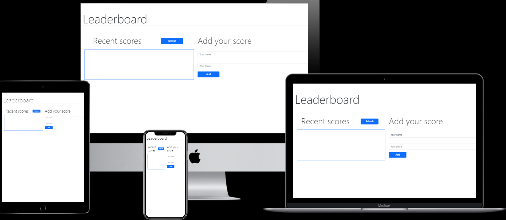

# Leaderboard   

> This project is a website that displays scores submitted by different players. It also allows you to submit your score. All functionality is implemented throughout a leaderboard API service provided by microverse.

## App screenshot 



## Built With 

- Webpack   
            
            
            
- Javascript
            
            
            
- HTML & CSS
            
            
            
- Bootstrap 
            
            
            

## Live Demo 


[Live Demo Link](https://wandergithub.github.io/Leaderboard/)


## Usage  

Be sure to have [Node.js](https://nodejs.org/) installed before proceeding.

```shell
# Clone the repo
git clone https://github.com/wandergithub/Leaderboard
# Change directory
cd Leaderboard
# Install dependencies
npm i
# Start local server
npm run start
```

## Authors  

👤 **Author1**


- GitHub: [@wandergithub](https://github.com/wandergithub)
- Twitter: [@wanderklk1](https://twitter.com/wanderklk1)
- LinkedIn: [Wander A. Gonzalez](https://www.linkedin.com/in/wander-a-gonzalez-53127b205/)

## Contributing  

Contributions, issues, and feature requests are welcome!

Feel free to check the [issues page](../../issues/).

## Show your support  

Give a ⭐️ if you like this project!

## License 

This project is [MIT](./MIT.md) licensed.
